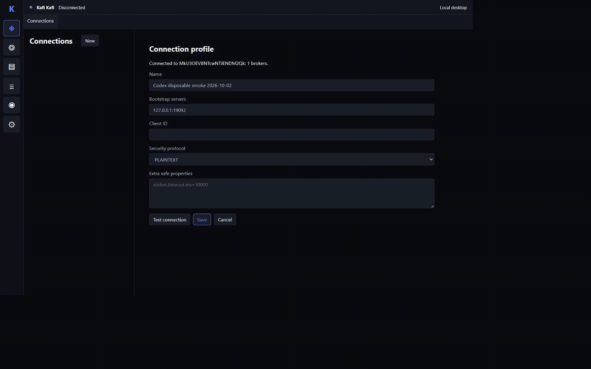

# Kafi Kafi

[](https://github.com/lumenikoly/kafi-kafi/actions/workflows/tauri-check.yml)
[](https://github.com/lumenikoly/kafi-kafi/releases)
[](https://github.com/lumenikoly/kafi-kafi/stargazers)
[](https://github.com/lumenikoly/kafi-kafi/issues)

Kafi Kafi is a desktop client for working with Apache Kafka clusters. It connects directly from your computer, so you can inspect a cluster, browse and produce messages, and manage consumer groups without deploying a separate backend.

[Visual example](#visual-example) · [Features](#features) · [Install](#install) · [Quick start](#quick-start) · [Development](#development) · [Documentation](#documentation) · [Migration status](#migration-status)

## Visual example



Connect to a Kafka cluster, inspect and produce records, and browse messages in either theme. These frames show the native 1.1.0 application using a local Kafka broker.

[Watch the MP4](docs/assets/kafi-kafi-demo.mp4) · [Full-size record inspector](videos/kafi-kafi-demo/assets/message-inspector.png) · [HyperFrames source and capture provenance](videos/kafi-kafi-demo/BRIEF.md)

## Features

- Save multiple connection profiles with `PLAINTEXT`, `SSL`, `SASL_PLAINTEXT`, or `SASL_SSL` security.
- Inspect cluster metadata, brokers, topics, partitions, replicas, and topic configuration.
- Search topics, hide internal topics, and create topics with custom partition, replication, and configuration values.
- Read messages from the latest offset, earliest offset, a specific offset, or a timestamp.
- Pause and resume consumption, select a partition, and filter loaded messages by key or value.
- Inspect message headers and complete JSON or text values, and identify binary payloads by size.
- Produce records with an optional key and partition, or fill the form from an imported message template.
- Choose a light or dark theme; the choice is saved for the next launch.
- Inspect consumer group members, assignments, committed offsets, and lag; reset offsets or delete inactive groups.
- Start a local single-node Kafka KRaft container through Podman or Docker.

The Tauri runtime stores profiles in the platform application-data directory and passwords in the system credential service. Settings offers explicit import from existing legacy user files in `~/.lightkafka`. See [credential migration](docs/security/credentials.md).

## Install

Tauri release builds produce these native packages for distribution through [GitHub Releases](https://github.com/lumenikoly/kafi-kafi/releases). Check release notes when downloading an older published version:

- Linux: AppImage
- Windows: NSIS installer and portable ZIP
- macOS: DMG image

Download the file for your operating system and launch it normally. On Linux, make the AppImage executable first:

```bash
chmod +x KafiKafi-*.AppImage
./KafiKafi-*.AppImage
```

## Run from source

Install the [native development prerequisites](docs/development.md), Node 22.18.0, pnpm 11.25.0 and the pinned Rust toolchain.

```sh
pnpm install --frozen-lockfile
pnpm tauri dev
```

## Quick start

1. Open **Connections**, create a profile, and enter your Kafka bootstrap servers and security settings.
2. Click **Test connection**, then **Save** and **Connect**.
3. Open **Topics** and select a topic to inspect its messages, partitions, and configuration.
4. In **Messages**, choose a start position and click **Start**. Select a record to inspect its key, value, and headers; use **Produce** to send a record.

Docker or Podman is needed only for optional local Kafka and broker integration tests.

## Development

```sh
pnpm lint
pnpm typecheck
pnpm test
pnpm build
cargo fmt --manifest-path src-tauri/Cargo.toml --check
cargo clippy --manifest-path src-tauri/Cargo.toml --locked --all-targets --all-features -- -D warnings
cargo test --manifest-path src-tauri/Cargo.toml --locked
pnpm tauri build
```

See [development](docs/development.md) for real Kafka fixtures and [releasing](docs/releasing.md) for the SemVer-tag workflow, platform packages and SHA-256 manifests. [1.1.0 release notes](docs/releases/1.1.0.md) describe the prepared version and remaining publication gates.

## Documentation

| I want to… | Read |
| --- | --- |
| Connect to Kafka | [Getting started](docs/guides/getting-started.md) |
| Browse and produce records | [Messages](docs/guides/messages.md) |
| Inspect consumer groups and offsets | [Consumer groups](docs/guides/consumer-groups.md) |
| Build and test the application | [Development](docs/development.md) |
| Understand the system boundaries | [Architecture](docs/architecture/overview.md) |
| Find other guides and reference material | [Documentation index](docs/index.md) |

## Migration status

The Rust/Tauri runtime lives in `src-tauri/` and the React interface in `src/`. This is the only application implementation; the Kotlin/JVM source and Gradle workflows have been removed. Read-only import of existing user data remains available. [Migration acceptance](docs/work/TASK-MIGRATION-001.md) records the remaining platform and performance checks.
