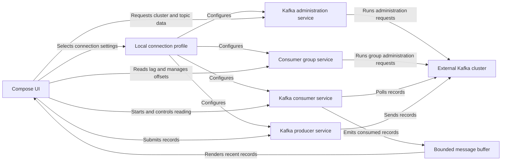

# Architecture

Light Kafka runs on the user's computer and connects directly to an external Kafka cluster. It does not run its own backend. The user operates a Compose UI, which calls the Kafka Java Client through coroutine-based services; connection profiles and encrypted secrets remain on the same computer.

## Module boundaries

| Module | Responsibility |
| --- | --- |
| `app-desktop` | Starts the application and owns the desktop window. |
| `ui` | Renders Compose screens and coordinates connection and workspace state. |
| `core-kafka` | Wraps Kafka administration, producer, and consumer clients in coroutine-based services. |
| `core-storage` | Persists profiles and encrypts their passwords. |

The application and UI depend on the two core modules. Neither `core-kafka` nor `core-storage` depends on Compose.

## Runtime interactions

## Lifecycle and reliability

- A successful switch to another profile closes the previous Kafka administration client.
- Each message screen creates a producer for the active profile and closes it when the screen leaves composition or the profile changes.
- A consumer session serializes all access to its Kafka consumer because that client does not permit concurrent calls.
- After a poll failure, the session waits for the configured poll interval before retrying.
- Stopping or restarting consumption, or cancelling its Compose coroutine, closes the consumer session.
- The UI retains at most the configured number of recent messages so a long-running session cannot grow its in-memory buffer without a bound.

## Local storage

Profiles and application settings are stored in `~/.lightkafka/storage.json`. SASL and SSL passwords are encrypted with AES-GCM in `~/.lightkafka/secrets/secrets.json`; the profile snapshot contains only references to those secrets. The encryption key is derived locally from a machine fingerprint and a random salt stored at `~/.lightkafka/secrets/.salt`.
