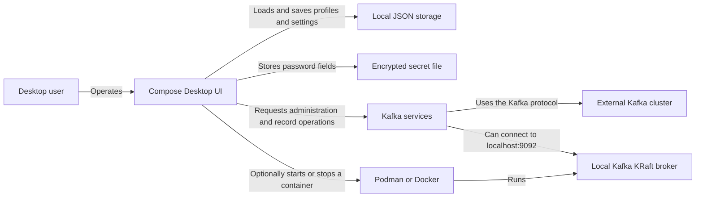

# Architecture

Kafi Kafi is a local desktop application that connects directly to an external Apache Kafka cluster. The user interacts with a Compose Desktop UI; coroutine-based services translate those actions into Kafka Java Client calls, while profiles and encrypted password fields remain on the user's computer. There is no Kafi Kafi backend or cloud service.

## System boundary

| Component | Responsibility |
| --- | --- |
| `app-desktop` | Starts the desktop process and owns the application window and native packaging. |
| `ui` | Renders the workspace and coordinates connection, topic, message, consumer-group, settings, and local-container state. |
| `core-kafka` | Wraps Kafka administration, producer, consumer, and consumer-group clients in coroutine-based services. |
| `core-storage` | Persists profiles and settings, and stores password fields through an encrypted local secret store. |
| External Kafka cluster | Accepts client requests, enforces its configured authentication and authorization, and remains the source of truth for metadata, topics, records, and offsets. |
| Podman or Docker | Optionally runs the local single-node Kafka KRaft container. |

The desktop application depends on the UI and both core modules. The UI depends on the core modules; neither core module depends on Compose.

## Runtime behavior

- A successful profile switch closes the previous Kafka administration client. A failed switch keeps the current connection active.
- Each topic message view owns its producer and closes it when the view or active profile changes.
- A consumer session serializes access to its Kafka consumer because the Kafka client does not permit concurrent calls.
- Poll failures are reported to the UI and retried after the configured poll interval.
- Stopping or restarting consumption, closing the view, or cancelling its coroutine closes the consumer session.
- The UI bounds its in-memory message list with the configured limit and removes older records as new records arrive.

## Local persistence

Profiles, settings, producer templates, and send-history storage share a versioned JSON snapshot at `~/.lightkafka/storage.json`. The current UI reads and writes profiles and settings; template and history persistence exist in the storage layer but are not exposed as user features.

SASL and SSL password values are encrypted with AES-GCM in `~/.lightkafka/secrets/secrets.json`. The profile snapshot stores references instead of plaintext password fields. A PBKDF2-derived key uses the local user, operating system, home path, and the random salt stored at `~/.lightkafka/secrets/.salt`.

## Architecture question map

There are currently no additional Markdown documents under `docs/architecture/`.
