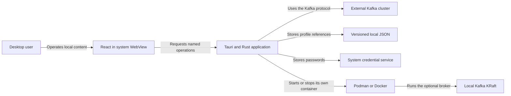

# Architecture

Kafi Kafi is a local desktop Kafka client. The runtime uses a bundled React interface inside Tauri; Rust talks directly to Kafka and to local operating-system services. There is no application server, telemetry service or required cloud account. Tauri/Rust/React is the only application implementation; Rust reads legacy user files only for explicit import.

## System boundary

| Component | Responsibility |
| --- | --- |
| `src/` | Renders navigation, tabs, virtual tables and inspectors; requests named operations through IPC. |
| `src-tauri/src/domain/` | Defines profiles, security settings and retained records; validates local inputs without depending on Tauri. |
| `src-tauri/src/app/` | Owns connection switching, session lifecycle and storage use cases. |
| `src-tauri/src/kafka/` | Encapsulates rust-rdkafka administration, production, inspection and group operations. |
| `src-tauri/src/ipc/` | Adapts Tauri commands and Channel delivery to application operations and explicit DTOs. |
| `src-tauri/src/storage/` and `secrets/` | Persist versioned JSON and system credential references; read legacy files only for explicit import. |
| `src-tauri/src/containers/` | Invokes Podman or Docker directly and verifies ownership of the optional local Kafka container. |
| External Kafka cluster | Owns records, topic configuration, authentication, authorization and consumer-group offsets. |
| System WebView and credential service | Render local bundled content and retain passwords outside application JSON. |

The desktop process owns one active connection with a reusable producer. A successful connection replaces the old runtime and cancels its sessions; a failed connection attempt keeps the working runtime. Blocking broker, disk and credential operations use background workers. Consumer tasks use Tokio cancellation and bounded buffers. The application does not run a local HTTP service in production.

## Architecture question map

- [How does the desktop interface request work without gaining general system access?](ipc.md)
- [How does message inspection keep memory and interface work bounded?](message-streaming.md)

```mermaid
flowchart LR
    User[Desktop user] -->|Operates local content| UI[React in system WebView]
    UI -->|Requests named operations| App[Tauri and Rust application]
    App -->|Uses the Kafka protocol| Kafka[External Kafka cluster]
    App -->|Stores profile references| Storage[Versioned local JSON]
    App -->|Stores passwords| Vault[System credential service]
    App -->|Starts or stops its own container| Engine[Podman or Docker]
    Engine -->|Runs the optional broker| Local[Local Kafka KRaft]
```

See [development](../development.md) for the native toolchain and [credentials](../security/credentials.md) for import and recovery. Removing the previous runtime does not establish cross-platform or performance acceptance; those checks remain explicit release gates.
